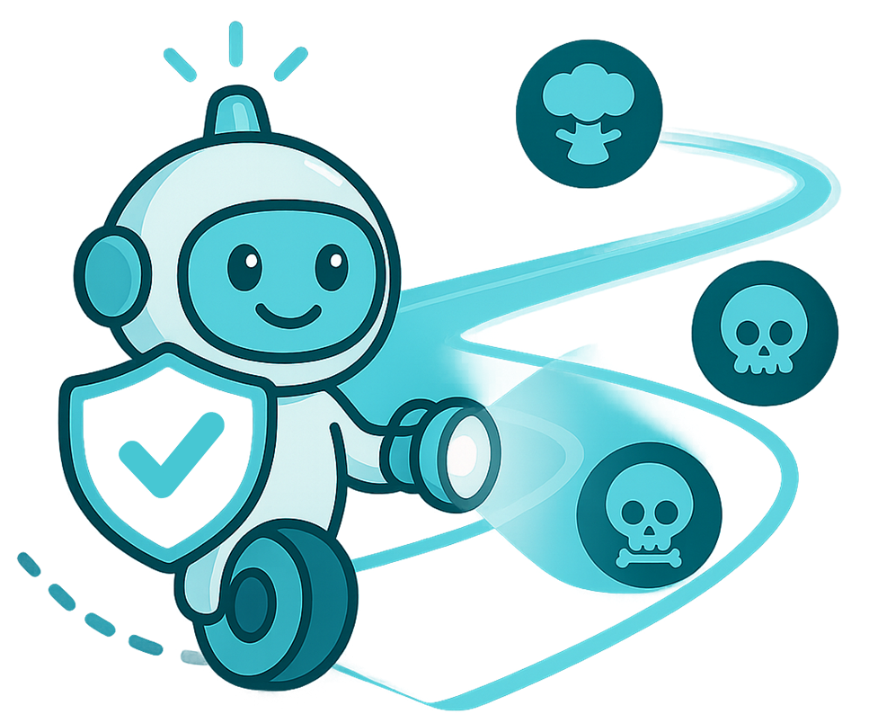

  

<h1 align="center">衛巡者 - AI Watchmen（Project Title）</h1>

生成式 AI 使用風險監測與管理工具

---

🎯 專為團隊導入生成式 AI 工具而設計，可即時監控對話、辨識風險、提供回饋報告。  
已支援 ChatGPT、Claude、Gemini、Grok 等主流模型，適用於教育機構、企業與政府部門。

---

## 🔧 功能模組總覽

| 模組             | 功能說明                                                                 |
|------------------|--------------------------------------------------------------------------|
| 🏁 初始設定       | 設定風險分級與通知規則，串接 Gmail、LINE 等通報工具                    |
| 📡 對話監測       | 多輪對話風險分析，支援文字／圖像內容解析                               |
| 🧪 行為模擬       | 建構自殘、洩密等負向情境與正向情境，模擬 AI 應對                       |
| 📊 狀態回饋       | 提供趨勢報告、互動統計、模擬結果建議                                   |

---

## 🚀 快速安裝指南

#### 1️⃣ 下載與解壓縮
- 前往 [`release/`](./release/) 資料夾下載最新 `.zip`
- 解壓縮後請 **保留資料夾結構** 不變

#### 2️⃣ 載入至 Chrome
- 打開 `chrome://extensions/`
- 開啟右上角 `開發人員模式`
- 點擊 `載入未封裝項目` 並選擇解壓資料夾

---

## 🔐 金鑰驗證機制

為確保服務安全，需輸入有效 Access Key 啟用正式功能：

| 版本類型     | 使用說明                                             |
|--------------|------------------------------------------------------|
| 🧪 體驗版     | 可免費試用一次，試用後需授權才能繼續使用              |
| 💼 正式版     | 使用開發團隊提供的 Access Token，有效期與權限可彈性設定 |

🔑 輸入金鑰方式：  
打開擴充套件 → 點選 `⚙️ 設定` → 🔐 授權 → 輸入金鑰並送出 → 顯示「授權成功」，解鎖對話監測與分析報告等完整功能

👉 [申請正式授權](https://www.aifreeteam.com/request-key) 或 Email: `ai.free.startup@gmail.com`

---

## 📂 專案結構

<pre>
ai-watchmen/
├── manifest.json           # Chrome 插件設定
├── background.js           # 背景監控主程式
├── content_script.js       # 擷取 AI 回覆
├── popup.html              # 插件介面
├── assets/                 # 圖示與樣式
└── release/                # 發布壓縮包
</pre>

---
## 🧪 測試瀏覽器支援情況

- ✅ Chrome (最新穩定版)
- ⏳ Microsoft Edge (測試中)
- 🚫 Firefox / Safari 暫不支援

---

## 📬 問題回報與聯絡

- 📧 技術支援信箱：`ai.free.startup@gmail.com`  
- 🐛 問題追蹤：[GitHub Issues](https://www.aifreeteam.com/ai-watchmen/issues)

---

## 📄 授權與使用條款
本套件目前為封閉測試版，僅限合作夥伴與內部單位使用。若需商業部署或 API 整合合作，請聯絡開發團隊。
